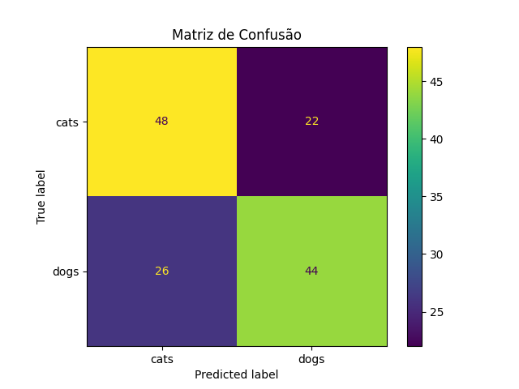

# ProvaV

#Descrição do problema

    Implementar um pipeline básico de visão computacional que inclui:
    - Carregamento e pré-processamento de imagens;
    - Extração de características;
    - Classificação por modelo de IA;

    Para isso, a database escolhida foi a de cachorros e gatos, onde posteriormente será feita a classifitação de novas instâncias.

#Etapas realizadas

    Classificador:
        Etapa 1 - Definir dos caminhos(de onde está a database) e parâmetros;
        Etapa 2 - Carregar e vetorizar as imagens usando cv2;
        Etapa 3 - Carregar os dados de treino e teste;
        Etapa 4 - Realizar o balanceamento;
        Etapa 5 - Realizar o pipeline, isso incluí a normalização, DecisionTree e GridSearchCV;
        Etapa 6 - Fazer a avaliação do modelo;
        Etapa 7 - Salvar os modelos;

    Nova Instância:
        Etapa 1 - Carrega os modelos salvos;
        Etapa 2 - Realiza o pré-processamento;
        Etapa 3 - Classifica e exibe as imagens;

#Justificativa das técnicas utilizadas

    Classificador:
        Etapa 1:
            Basicamente, eu pego o local de onde está a base de dados para extrair os dados e defino o tamanho das imagens que serão treinadas posteriormente.
        Etapa 2:
            Serparo X e y, onde X é será nossas imagens e y será nossa classe.
            Usando cv2, se lê as imagens e depois converte elas para RGB para facilitar o processamento e visualização padrão.
            A linha cv2.resize(img_rgb, IMG_SIZE, interpolation=cv2.INTER_AREA), básicamente a redimenciona para um tamanho fixo (128x128), para padronizar, usando interpolação para criar novos pixeis, assim a imagem não fica distorcida.
            Em geral, realiza um pré-processamento nas imagens.
        Etapa 3: 
            É criado listas para armazenas os dados para treino e para teste em X e y. (Listas de treino)
            Para as classes "cats"(classe 0) e "dogs"(classe 1), é carregado as imagens da pasta de train e posteriormente para a pasta test, adicionando os vetores e rótulos nas listas de treino.
            Como modelos de machine learning geralmente esperam arrays NumPy como entrada, não listas, o np.vstack os empilha em vetores e depois os converte em arrays.
        Etapa 4: 
            É realizado o balanceamento com SMOTE para que ele aumente a diversidade de classes minoritárias, reduzindo viés sem precisar duplicar amostras, o que melhora a generelização do modelo.
        Etapa 5:
            O objetivo do pipeline é garantir que a aplicação consistente das etapas de pré-processamento e modelagem em cada fold, evitando vazamento de dados.
            O MinMaxScaler uniformiza a escala das features em [0,1], prevenindo que variáveis de maior amplitude dominem as divisões da árvore.
            O DecisionTreeClassifier captura relações não lineares e interações sem transformações complexas.
            O GridSearchCV faz busca exaustiva de hiperparâmetros com validação cruzada para otimizar performance e reduzir viés.
            Os hiperparâmetros explorados foram os critérios de divisão, estratégia de splitter, profundidade, tamanho mínimo de nós e número de features para gerar robustez e controlar overfitting.
            Os parâmetros adicionais que são o uso de n_jobs=-1 e verbose=2 acelera e monitora a busca, e return_train_score=True auxilia na identificação de overfitting.
        Etapa 6:
            best_estimator_: representa o pipeline ajustado com os melhores hiperparâmetros para uso direto na predição.
            predict(X_test): gera as previsões do modelo otimizado sobre dados não vistos (conjunto de teste).
            accuracy_score: calcula a proporção de previsões corretas, fornecendo uma visão geral de acurácia.
            precision_score(average='macro'): mede a capacidade do modelo em evitar falsos positivos, ponderando igualmente cada classe.
            recall_score(average='macro'): avalia a habilidade do modelo em identificar verdadeiros positivos para cada classe de forma balanceada.
            f1_score(average='macro'): combina precisão e recall em uma única métrica harmônica, refletindo equilíbrio entre ambas.
            classification_report: exibe detalhadamente precisão, recall e F1 para cada classe, facilitando análise granular de performance.
            ConfusionMatrixDisplay.from_estimator: gera e plota a matriz de confusão diretamente do estimador, facilitando a visualização de erros de classificação entre ‘cats’ e ‘dogs’.
        Etapa 7:
            plt.title e plt.show: adicionam um título descritivo e exibem a figura, melhorando a interpretabilidade do gráfico.
            os.makedirs(..., exist_ok=True): garante que o diretório de saída exista antes de salvar, evitando erros de caminho.
            dump(scaler, 'image_scaler.pkl'): persiste o objeto de normalização para uso consistente em futuras previsões.
            dump(clf, 'image_tree_model.pkl'): serializa o modelo treinado para implantação ou reuso sem necessidade de novo treinamento.

    Nova Instância:
        Etapa 1:
            load(open()): Carrega os modelos.
        Etapa 2:
            cv2.imread: carrega o arquivo de imagem.
            cv2.resize: padroniza o tamanho das imagens em 128×128 pixels, sendo igual ao com o treinamento.
            cv2.cvtColor: simplifica o conteúdo mantendo informações de intensidade para equalização de histograma, e deixa a imagem cinza, no contexto atual.
            cv2.equalizeHist: melhora o contraste distribuindo uniformemente os níveis de cinza.
            cv2.merge: reconstrói uma imagem 3-canais a partir da versão equalizada em tons de cinza, compatível com um pipeline RGB.
            cv2.GaussianBlur: suaviza ruídos e pequenas variações, facilitando a extração de características estáveis aplicando um blur.
            flatten().astype(np.float32): transforma a imagem em um vetor unidimensional de floats, conforme exigido pelo classificador.
        Etapa 3:
            for file in os.listdir(IMG_DIR): itera sobre todos os arquivos no diretório de imagens para processá-los em lote.
            if file.lower().endswith('.jpg'): filtra apenas arquivos JPEG, evitando erros ao tentar ler outros formatos.
            img_path = os.path.join(IMG_DIR, file): constrói o caminho completo do arquivo de forma portátil entre sistemas operacionais.
            features, preprocessed_img = preprocess_image(img_path): obtém o vetor de características e a imagem pré-processada em uma única chamada de função.
            features_scaled = scaler.transform([features]): aplica a normalização previamente treinada aos novos dados para manter consistência.
            pred_index = model.predict(features_scaled)[0]: gera o índice da classe prevista usando o modelo treinado.
            pred_class = model.classes_[pred_index]: converte o índice numérico de volta ao nome da classe (‘cats’ ou ‘dogs’).
            plt.imshow(cv2.cvtColor(preprocessed_img, cv2.COLOR_BGR2RGB)): exibe a imagem pré-processada em cores corretas para visualização.
            plt.show(): renderiza o gráfico, mostrando a imagem e sua previsão ao usuário.
    
#Resultados obtidos

                precision    recall  f1-score   support

            cats       0.65      0.69      0.67        70
            dogs       0.67      0.63      0.65        70

        accuracy                           0.66       140
        macro avg       0.66      0.66      0.66       140

    Durante o processo de classificação, ele errou 3 imagens, acertando apenas 50% das imagens, sendo os erros as imagens de 2 gatos e 1 cachorro. 

#Tempo total gasto

    Levou-se algum tempo para conseguir realizar o código, mas o mais demorado foi o python, que por algum motivo estava bugado e tive que reinstalar ele, já que ele não conseguia ler algumas bibliotecas, como a matplotlib.
    Em geral, dudante o treinameiro, resultou em cerca de 32 minutos.

#Dificuldades encontradas

    Dificuldades com a biblioteca do python e o python em si, pois ele não funcionava o tensorflow de forma alguma, então desisti dessa biblioteca e posteriormente tive que o reinstalar para conseguir usar efetivamente as bibliotecas.
    Tempo de execução do treinamento foi um pouco longo, afinal, tive que treinalo mais de uma vez, onde eu havia percebido que precisaria que as imagens de uma nova instância precisariam estar com o mesmo tamanho, onde inicialmente era 60x60, onde percebi meu erro somente após treinar.
